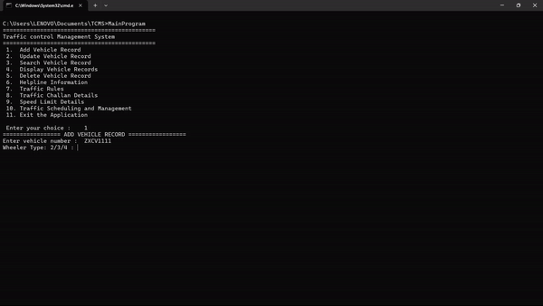
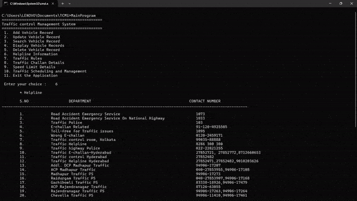

# Vehicle Management Platform
An advanced C++ application for managing vehicle records, implementing object-oriented principles and singleton design patterns to ensure resource optimization and system reliability. The platform includes features for error handling, helpline integration, and adherence to traffic regulations, enhancing safety and accuracy in traffic management.
  
<b> Features </b>
 
→ Singleton Design Pattern  
→ Add Vehicle Record   
→ Update Vehicle Record   
→ Search Vehicle Record   
→ Display Vehicle Records   
→ Delete Vehicle Record   
→ Helpline Information   
→ Traffic Rules   
→ Challan Details   
→ Speed Limit Details   
→ Traffic Control Booth   
 
# Usage
The application offers a console-based interface for interacting with the vehicle management system. Users can select from various options to add, update, search, display, or delete vehicle records, as well as access additional resources like helpline information, traffic rules, challan details, speed limits, and traffic control booth information.
 
# Implementation
  

  

